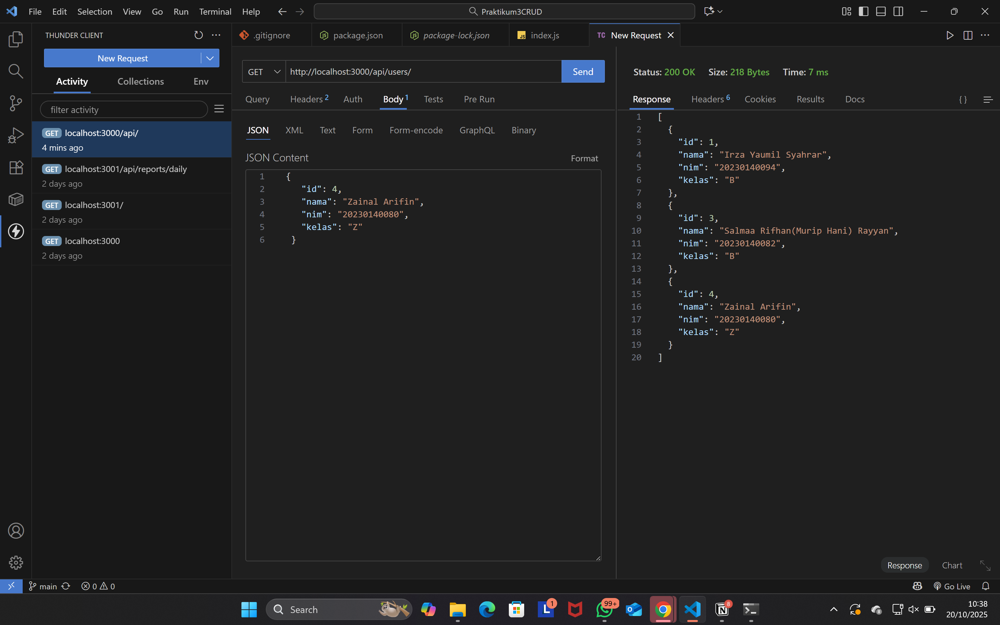
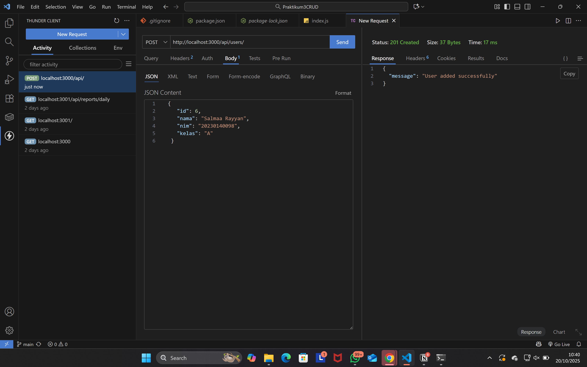
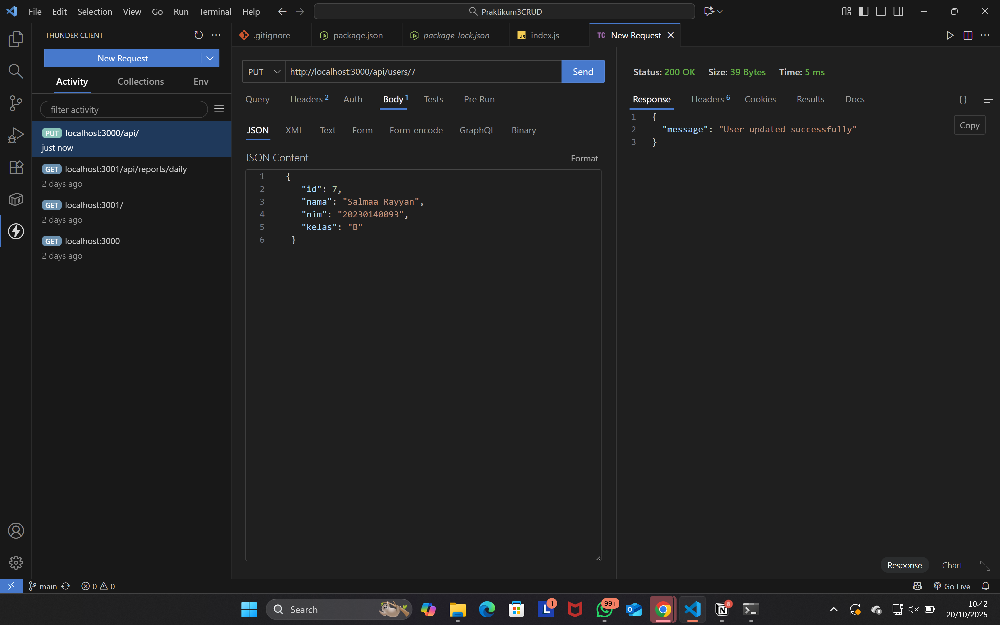
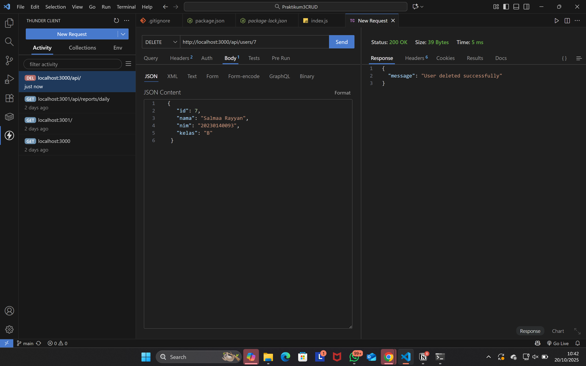

## Implementasi endpoint GET, POST, PUT, DELETE menggunakan data lokal

Dokumentasi singkat implementasi endpoint dasar dengan Express.

- GET: Mengambil seluruh data
- POST: Menambah data baru
- PUT: Memperbarui data berdasarkan id
- DELETE: Menghapus data berdasarkan id

GET

POST

PUT

DELETE

